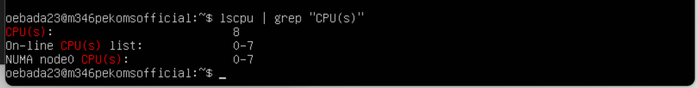

#KN01
## CPU mit weniger Cores than Gast-System

## CPU mit mehr Cores than Gast-System

Hyper-Threading ermöglicht virtuelle Threads auf physischen CPU Kernen zu erstellen Nutzung der Kerne effizienter. Es erlaubt gleichzeitige Ausführung von mehreren Aufgaben. Die Zuteilung von mehr Threads als physisch vorhandene Kerne wird normalerweise nicht als separate CPU-Zuteilung betrachtet.

## Weniger RAM als Gast-System

## Mehr RAM als Gast-System

