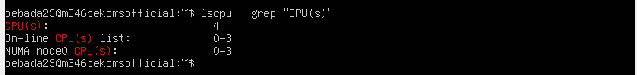
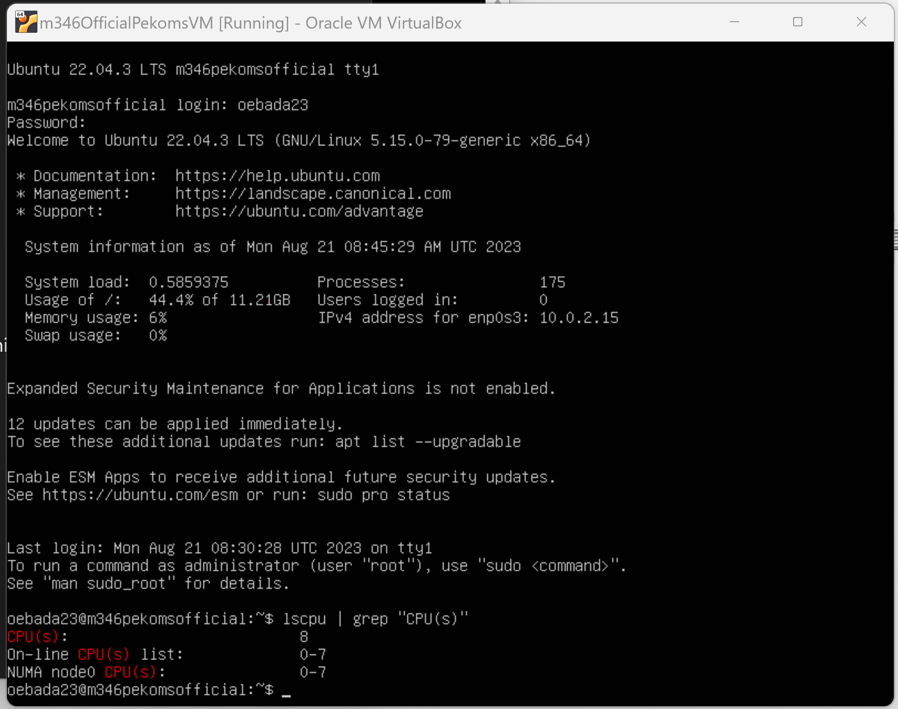
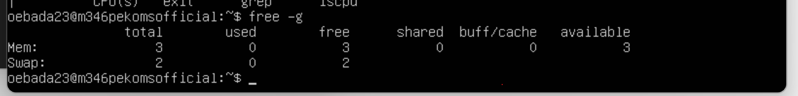
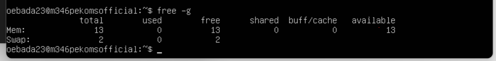
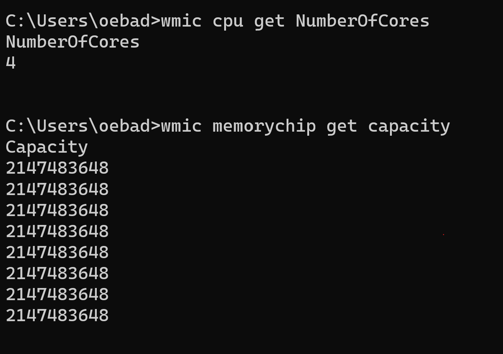

# m346
pekoms.-

1. [KN01](#kn01)
2. [KN02](#kn02)

# KN01
### CPU mit weniger Cores than Gast-System

### CPU mit mehr Cores than Gast-System

Hyper-Threading ermöglicht virtuelle Threads auf physischen CPU Kernen zu erstellen, somit kann man die Nutzung der Kerne effizienter machen. Es erlaubt die gleichzeitige Ausführung von mehreren Aufgaben.

### Weniger RAM als Gast-System

### Mehr RAM als Gast-System

### Gast-System Eigenschaften

# KN02
## Lab 4.1 - EC2
### HTML-Seite, inkl. URL

### Liste der EC2-Instanzen

### Details der Web Server-Instanz (öffentliche IP sichtbar)

### Security-Group: Liste der Inbound-Regeln

## Lab 4.2 - Buckets 
### Liste der Buckets

### HTML-Seite, inkl. URL.

### Liste der Dateien im Bucket

### Eigenschaften von "Static website hosting"

